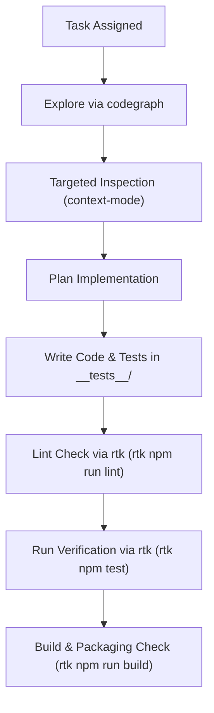

# AGENTS.md

> Operational Guidelines & Architectural Standards for Agentic Development
> **Repository:** `trust-management-utility`

---

## 1. Core Mandates

All autonomous AI agents, subagents, and human developers collaborating with agentic workflows must strictly adhere to the following seven mandatory rules.

### Rule 1: Use `context-mode` for Large Outputs

- **Principle**: Prevent LLM context saturation and token budget exhaustion by streaming, indexing, and querying large outputs instead of dumping raw content directly into context.
- **Protocol**:
  - When analyzing directories, inspecting logs, processing data-heavy outputs, or reviewing large files, utilize `context-mode` tools (`ctx_execute`, `ctx_search`, `ctx_index`, `ctx_batch_execute`).
  - Use targeted line ranges (`StartLine`, `EndLine`) with pagination when viewing source code rather than loading unbounded files.
  - Never dump thousands of lines of terminal output or bundle logs into the interaction stream. Filter or query with `context-mode` tools first.

### Rule 2: Use `rtk` for Shell and Bash Commands

- **Principle**: Always use [RTK (Rust Token Killer)](file:///.agents/rules/antigravity-rtk-rules.md) to proxy shell and CLI commands. RTK intercepts, strips noise, formats, and compresses stdout/stderr before it reaches model context, saving 60–90% of tokens.
- **Protocol**:
  - Prefix execution commands with `rtk`:
    ```bash
    rtk git status
    rtk git diff --stat
    rtk npm test
    rtk npm run build
    rtk ls -la src/
    rtk grep -rn "pattern" src/
    ```
  - Use RTK meta commands when monitoring savings or troubleshooting:
    ```bash
    rtk gain              # Show accumulated token savings
    rtk gain --history    # Review historical savings per command
    rtk discover          # Detect non-proxied command invocations
    rtk proxy <cmd>       # Pass-through raw output when debugging low-level issues
    ```

### Rule 3: Use `codegraph` First for Exploring the Codebase

- **Principle**: Code exploration must be grounded in structural understanding, not brute-force directory traversal or indiscriminate file reading.
- **Protocol**:
  - Always invoke `codegraph_explore` or query the `.codegraph` index as your initial step when discovering code structure, tracing caller-callee graphs, finding type definitions, or analyzing component dependencies.
  - Formulate structural queries before opening individual source files:
    1. Locate the entry point or symbol definition via `codegraph`.
    2. Inspect inbound and outbound references to map impact radius.
    3. Read only the specific files and line spans identified by the graph.
  - Never run recursive whole-tree scans (`grep -r` across the entire repo or dumping entire directory structures) when `codegraph` can resolve the path directly.

### Rule 4: Cognitive Complexity Must Be Below 15

- **Principle**: Code clarity and maintainability are strictly enforced. Every function, method, custom hook, and callback must maintain a cognitive complexity score strictly **below 15** (SonarSource cognitive complexity metric).
- **Guidelines**:
  - **Flatten Nesting**: Avoid deep `if`/`else`, nested loops, or nested ternaries. Use early guard returns.
  - **Decompose Handlers**: Extract complex event handlers, data transformations, and state updates into focused, single-purpose pure helper functions.
  - **Modularize Hooks**: Break monolithic React hooks or Zustand actions into composable sub-hooks and separate selector/reducer modules.
  - **Replace Complex Branching with Data Structures**: Use lookup tables, strategy maps, or polymorphic dispatch instead of switch-case ladders or chained conditional blocks.

### Rule 5: All Regex Must Be ReDoS-Free and Linear

- **Principle**: Prevent Regular Expression Denial of Service (ReDoS). All regular expressions must run in guaranteed linear time $\mathcal{O}(n)$ with respect to input length.
- **Guidelines**:
  - **Ban Catastrophic Backtracking Patterns**: Never use nested quantifiers such as `(a+)+`, `(a*)*`, `(a|b+)*`, overlapping repeating groups `(a|a)+`, or unanchored suffix quantifiers such as `/\/+$/` (which cause quadratic $\mathcal{O}(n^2)$ backtracking in NFA engines).
  - **Avoid Ambiguous Wildcard Repetition**: Avoid unanchored patterns like `.*` inside repeating capture groups (e.g., `^.*(a|b).*$`).
  - **Prefer String Primitives & Dedicated Utilities**: When searching for fixed substrings, prefixes, or suffixes (such as stripping trailing slashes or trimming separators), always prefer native string methods (`String.prototype.includes()`, `startsWith()`, `endsWith()`, `indexOf()`, `slice()`) or linear string utilities (e.g. `src/utils/urlUtils.ts`) over regex.
  - **Input Boundaries & Length Limits**: When validating user inputs or file contents (e.g., Excel imports or entity names), enforce maximum string lengths before applying regex.

### Rule 6: Dedicated `__tests__` Folder Excluded from Executable Builds

- **Principle**: Tests must be cleanly isolated and never contaminate production bundles or executable binaries.
- **Protocol**:
  - All unit, component, and integration tests must reside inside dedicated `__tests__/` directories (e.g., `src/**/__tests__/*.test.ts`, `src/**/__tests__/*.test.tsx`).
  - Test utilities, mocks, and fixtures must be housed under test-specific directories (e.g., `src/test/` or `__tests__/fixtures/`).
  - Production packaging configurations (`tsconfig.json`, `vite.config.ts`, and `electron-builder.json`) must exclude `__tests__` folders, ensuring no test code, fixtures, or test runners are included in `dist/` or bundled into installer binaries (`release/`).

### Rule 7: Adhere to Superpower Skills and Disciplined Engineering Workflows

- **Principle**: Autonomous agents and developers must leverage superpower skills to enforce disciplined, test-backed, and systematically verified engineering processes across all tasks.
- **Protocol**:
  - **Brainstorming & Requirements**: Explore user intent, clarify ambiguities, and compare architectural designs before implementation (`brainstorming`).
  - **Planning**: Formulate detailed, structured, step-by-step implementation plans before modifying code (`writing-plans`).
  - **Test-Driven Development (TDD)**: Write failing tests in dedicated `__tests__/` directories before writing implementation code (`test-driven-development`).
  - **Systematic Debugging**: When bugs or failures arise, systematically trace root causes using evidence rather than guessing or speculative fixes (`systematic-debugging`).
  - **Verification Before Completion**: Run verification commands (`rtk npm run lint`, `rtk npm test`, `rtk npm run build`) and inspect results before declaring any task complete (`verification-before-completion`).

---

## 2. Tech Stack Reference

| Layer | Technologies |
| :--- | :--- |
| **Runtime / Desktop** | Electron 44+ (Node 22 / Chromium) |
| **UI Framework** | React 18 (TypeScript), Tailwind CSS |
| **State Management** | Zustand |
| **Diagram & Graph** | `@xyflow/react` (React Flow), `@dagrejs/dagre` |
| **File I/O & Export** | `xlsx` (Excel), `jspdf` (PDF), `html-to-image` (Canvas Rendering) |
| **Linting & Quality** | ESLint 9+ (`eslint-plugin-sonarjs`, `eslint-plugin-regexp`), Husky 9 (pre-commit) |
| **Build & Tooling** | Vite 6, TypeScript 5.7, Vitest 4, Electron-Builder 26 |
| **Token Optimization**| RTK (`rtk`), `context-mode` |
| **Code Intelligence** | `codegraph` (`.codegraph/`) |

---

## 3. Standard Agent Workflow



1. **Discovery**:
   - Query `codegraph` for symbols, call sites, and file relationships.
   - Inspect files using `view_file` with precise line ranges or `context-mode`.

2. **Execution**:
   - Run shell commands exclusively via `rtk <command>`.
   - Write tests in dedicated `__tests__/` directories before or alongside implementation.
   - Ensure linear regex and verify cognitive complexity is `< 15`.

3. **Validation**:
   - Run linter (strictly enforcing Rule 4 & 5): `rtk npm run lint`
   - Run test suite: `rtk npm test`
   - Run type checks and build: `rtk npm run build` (build executes lint check automatically)
   - Verify that test files and test dependencies remain strictly excluded from release bundles.
