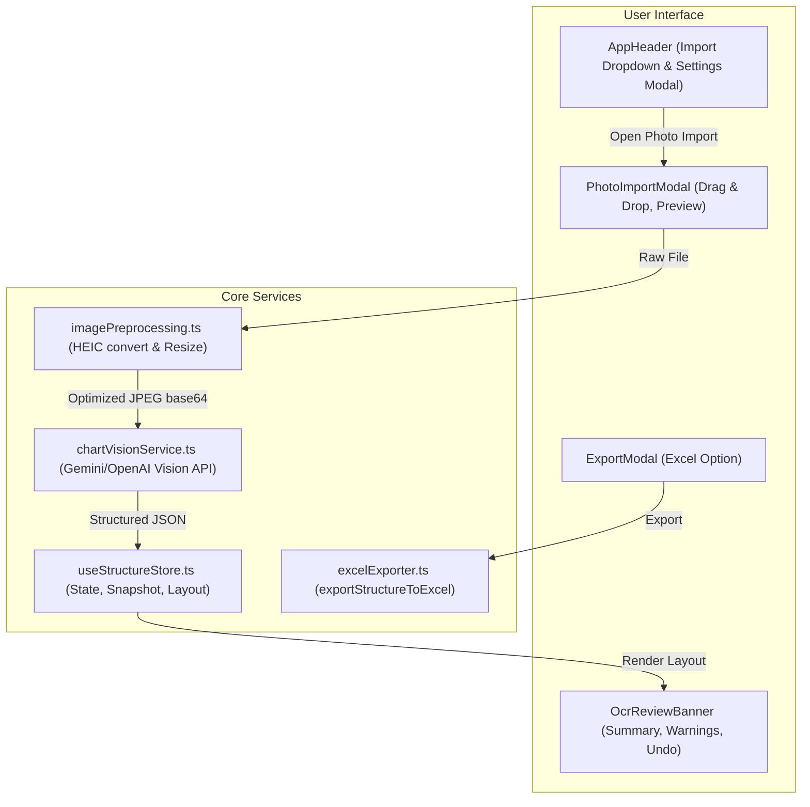

# Design Document: Excel Structure Export & Handwritten Chart Photo LLM OCR

**Date:** 2026-09-21  
**Status:** In Review  
**Repository:** `trust-management-utility`

---

## 1. Executive Summary

This feature expands the Trust Management Utility with two core capabilities tailored to trust officers and fiduciary practitioners:
1. **Excel Structure Export**: Export the active canvas chart directly to an Excel spreadsheet (.xlsx) conforming to the standard 12-column import template. This creates a complete round-trip (Export $\leftrightarrow$ Import) between spreadsheets and interactive charts.
2. **Handwritten Chart Photo OCR (Multimodal LLM)**: Allow trust officers who draw structure charts on paper during client visits to upload a photo (.jpg, .png, .webp, .heic). A vision LLM (Google Gemini by default, with configurable OpenAI support) analyzes the diagram, extracts entities, parent-child relationships, ownership percentages, jurisdictions, and roles, and automatically instantiates the complete chart on canvas with an undo/review banner.

---

## 2. Requirements & Scope

### Functional Requirements

#### Feature 1: Excel Structure Export
- **FR-1.1**: Export all current entities and relationships from the store into a valid `.xlsx` workbook with a `Structure` sheet.
- **FR-1.2**: Conform strictly to the 12 standard template columns:
  `Entity Name`, `Parent Entity`, `Ownership %`, `Entity Type`, `Jurisdiction`, `Status`, `Directors`, `Registration No`, `Tax ID`, `UBOs / Beneficiaries`, `Share Class`, `Notes`.
- **FR-1.3**: Support multi-parent entities by generating one row per parent relationship (preserving ownership percentage and share class).
- **FR-1.4**: Serialize root entities (no parent) with empty `Parent Entity` and 100% or blank ownership.
- **FR-1.5**: Serialize directors with standard role annotations: e.g. `David Tan (Res); Sterling Corp Ltd (Corp)`.
- **FR-1.6**: Add an "Excel Workbook (.xlsx)" card inside `src/components/export/ExportModal.tsx` that triggers the download.

#### Feature 2: Handwritten Chart Photo OCR
- **FR-2.1**: Support image uploads in `.jpeg`, `.jpg`, `.png`, `.webp`, `.heic`, `.heif`.
- **FR-2.2**: Automatically convert iPhone `.heic`/`.heif` files into JPEG blobs client-side using `heic2any`.
- **FR-2.3**: Downscale/compress excessively large images (max 2048px on longest edge) prior to transmission to optimize token consumption and speed.
- **FR-2.4**: Provide a configurable **Settings Modal** (gear icon in header) allowing users to configure API provider (Google Gemini default, OpenAI compatible), enter their API Key, select models, and test the connection. Credentials are saved in local storage.
- **FR-2.5**: Replace the single "Import Excel" button in `AppHeader` with a unified **"Import" Dropdown** offering:
  - *Import from Excel (.xlsx)*
  - *Import from Photo / Hand-drawn Chart (AI OCR)*
- **FR-2.6**: Send the image to the multimodal LLM with a structured system prompt and strict JSON schema defining `TrustStructureChart` (entities + relationships + confidence warnings).
- **FR-2.7**: Replace current canvas chart with confirmation if unsaved items exist, auto-run Dagre layout (`calculateSortedLayout`), and display a persistent floating **OcrReviewBanner** displaying extraction statistics, extraction warnings (e.g. illegible text, assumed percentages), an **Undo Import** action, and a **Dismiss** action.

### Non-Functional Requirements & Constraints
- **NFR-1**: Cognitive complexity of every function and hook must remain strictly `< 15` (SonarSource metric).
- **NFR-2**: All regular expressions must run in linear time $\mathcal{O}(n)$ with bounded input length to prevent ReDoS.
- **NFR-3**: All tests must reside in `src/__tests__/` and be excluded from production packaging.
- **NFR-4**: API keys must never be committed to git or leaked into production logs.
- **NFR-5**: Maintain 100% test pass rate across all existing and new test suites.

---

## 3. Architecture & Detailed Design



### 3.1 Feature 1: Excel Structure Exporter (`src/utils/excelExporter.ts`)

#### 1. Data Transformation
- Create helper `formatDirectorsString(directors: Director[]): string`:
  Transforms each director into `Name (Corp)` or `Name (Res)` or `Name (Corp, Res)` and joins them with `; `.
- Create helper `buildExcelRowsFromChart(chart: TrustStructureChart): Record<string, any>[]`:
  - Build an adjacency lookup: for each entity ID, find all incoming edges in `relationships` where `edge.target === entity.id`.
  - For each entity:
    - If incoming edges count is $0$: emit 1 row with `Parent Entity: ''` and `Ownership %: 100`.
    - If incoming edges count $\ge 1$: emit one row per incoming edge, mapping `edge.source` to parent name, `edge.ownershipPercentage`, and `edge.shareClass`.
- Create function `exportStructureToExcel(chart: TrustStructureChart): Uint8Array`:
  - Uses `XLSX.utils.json_to_sheet` with predefined column widths (matching `generateExcelTemplate`).
  - Creates workbook with sheet `'Structure'`.
  - Returns `new Uint8Array(XLSX.write(wb, { type: 'array', bookType: 'xlsx' }))`.

#### 2. ExportModal Integration
Add an Excel card to `src/components/export/ExportModal.tsx`:
- Card title: *Excel Spreadsheet (.xlsx)*
- Subtitle: *Editable structure table matching the import template*
- Action: Generates `.xlsx` from `{ metadata, entities, relationships }` and triggers file download `${safeTitle}_Structure.xlsx`.

---

### 3.2 Feature 2: Handwritten Photo OCR & Multimodal LLM Architecture

#### 1. Configuration & Storage (`src/services/ai/aiConfig.ts`)
Define persistent configuration types:
```typescript
export type AIProvider = 'gemini' | 'openai';

export interface AIConfig {
  provider: AIProvider;
  apiKey: string;
  model: string; // default: 'gemini-2.5-flash' for gemini, 'gpt-4o' for openai
  customEndpoint?: string;
}
```
Provide helper methods:
- `getAIConfig(): AIConfig`: Retrieves configuration from `localStorage` (fallback to `gemini-2.5-flash`).
- `saveAIConfig(config: AIConfig): void`: Persists configuration.
- `hasValidApiKey(): boolean`: Quick check if key is present.

#### 2. Image Preprocessing & HEIC Conversion (`src/utils/imagePreprocessing.ts`)
- **HEIC Conversion**: Check file extension or mime type (`image/heic`, `image/heif`, or extension `.heic`/`.heif`). If detected, invoke `heic2any({ blob: file, toType: 'image/jpeg', quality: 0.85 })`.
- **Client-Side Downscaling**:
  - Load blob into `HTMLImageElement` via `createImageBitmap` or `Image` object.
  - If width or height exceeds 2048px, scale down proportionally while maintaining aspect ratio.
  - Draw to offscreen HTML canvas and export to JPEG base64 data URL.
  - Enforce linear byte processing and memory disposal (`URL.revokeObjectURL`).

#### 3. Vision Prompt & Structured Response Schema (`src/services/ai/chartVisionService.ts`)
Prompt design instructs the LLM:
- Identify every entity box / shape (name, inferred legal type like Trust, Holding Company, LLC, Operating Company, jurisdiction, registration number if noted, directors/trustees).
- Trace lines and arrows connecting entities:
  - Source is the parent/owner (arrow tail or higher in hierarchy).
  - Target is the subsidiary/owned entity (arrow head or lower in hierarchy).
  - Parse ownership percentages written on or beside lines (e.g. `100%`, `50%`).
  - Distinguish cross-links vs direct ownership if indicated.
- Note any ambiguities, illegible words, or inferred guesses in a `warnings` string array.

**JSON Schema Response Specification**:
```json
{
  "type": "object",
  "properties": {
    "chartTitle": { "type": "string" },
    "entities": {
      "type": "array",
      "items": {
        "type": "object",
        "properties": {
          "tempId": { "type": "string" },
          "name": { "type": "string" },
          "type": { "type": "string", "enum": ["Trust", "Trust Company", "Holding Company", "Operating Company", "LLC", "Foundation", "Partnership", "Individual"] },
          "jurisdiction": { "type": "string" },
          "registrationNumber": { "type": "string" },
          "taxId": { "type": "string" },
          "status": { "type": "string", "enum": ["Active", "Dormant", "In Liquidation", "Nominee"] },
          "directors": {
            "type": "array",
            "items": {
              "type": "object",
              "properties": {
                "name": { "type": "string" },
                "isCorporate": { "type": "boolean" },
                "isResident": { "type": "boolean" }
              },
              "required": ["name"]
            }
          },
          "ubosOrBeneficiaries": { "type": "array", "items": { "type": "string" } },
          "notes": { "type": "string" }
        },
        "required": ["tempId", "name", "type", "jurisdiction"]
      }
    },
    "relationships": {
      "type": "array",
      "items": {
        "type": "object",
        "properties": {
          "sourceTempId": { "type": "string" },
          "targetTempId": { "type": "string" },
          "ownershipPercentage": { "type": "number" },
          "shareClass": { "type": "string" }
        },
        "required": ["sourceTempId", "targetTempId"]
      }
    },
    "warnings": {
      "type": "array",
      "items": { "type": "string" }
    }
  },
  "required": ["entities", "relationships"]
}
```

#### 4. LLM API Execution & Graph Normalization
- For **Gemini**: Calls Google Gemini generateContent endpoint with `responseMimeType: 'application/json'` and `responseSchema`.
- For **OpenAI**: Calls `chat/completions` endpoint with `response_format: { type: 'json_object' }`.
- Post-process:
  - Maps `tempId` to secure unique UUIDs (`generateSecureId('entity')` and `generateSecureId('edge')`).
  - Guarantees valid entity types and default statuses.
  - Runs graph cycle detection and cleans orphan edges.

---

### 3.3 UI Integration & Workflow

1. **Header Import Dropdown (`src/components/header/AppHeader.tsx`)**:
   - Replaces the single "Import Excel" button with an "Import" button showing a dropdown menu:
     - 📊 *Import Excel Spreadsheet (.xlsx)*
     - 📷 *Import from Photo / Hand-drawn Chart (AI OCR)*
   - Adds a Settings icon button (gear) next to Reset / Export to open `SettingsModal.tsx`.

2. **Settings Modal (`src/components/settings/SettingsModal.tsx`)**:
   - Select Provider: Google Gemini (default) or OpenAI.
   - API Key input (masked with show/hide toggle).
   - Model selection (default `gemini-2.5-flash` or custom text).
   - "Test Connection" button that sends a ping to the model.

3. **Photo Upload Modal (`src/components/import/PhotoImportModal.tsx`)**:
   - Drag & drop zone supporting image files and camera snapshots.
   - Shows image thumbnail preview once dropped.
   - If API key is missing: shows inline alert with direct "Configure API Key" button.
   - "Analyze & Create Chart" button triggers processing pipeline with progress bar:
     - Step 1: Converting image (HEIC)
     - Step 2: Optimizing resolution
     - Step 3: Performing multimodal AI analysis
   - Handles errors gracefully (e.g. invalid API key, network timeout, unreadable image).

4. **Review & Undo Banner (`src/components/canvas/OcrReviewBanner.tsx`)**:
   - If the canvas already had nodes, the user is prompted to confirm replacement. The prior chart is saved in an undo snapshot in `useStructureStore`.
   - Once the new chart is loaded, Dagre auto-layout runs immediately.
   - A floating pill banner renders at the top of the canvas:
     - Badge: 📷 *Inferred from Photo: 6 entities, 5 relationships*
     - If warnings exist: clickable *"3 extraction warnings"* badge opening a popover with details (e.g. *"Assumed 100% ownership for Holding Co $\rightarrow$ Sub Co"*).
     - **Undo Import** button (restores snapshot).
     - **Keep / Dismiss** button.

---

## 4. State Management Updates (`src/store/useStructureStore.ts`)

Add snapshot / undo support for OCR import:
- `undoSnapshot: TrustStructureChart | null`
- `setUndoSnapshot: (snapshot: TrustStructureChart | null) => void`
- `restoreUndoSnapshot: () => void`
- `ocrReviewState: { summary: string; warnings: string[] } | null`
- `setOcrReviewState: (state: { summary: string; warnings: string[] } | null) => void`
- `dismissOcrReview: () => void`

---

## 5. Security & Privacy Considerations

- **Client Data Confidentiality**: Photos of trust structures contain sensitive family and wealth ownership data. The settings modal will explicitly inform users which API endpoint is being contacted.
- **Local Storage Security**: API keys are stored in `localStorage` in the user's isolated desktop profile, never sent to third parties other than the selected provider's official API endpoint.
- **No Telemetry / No Training**: System prompts will specify standard fiduciary confidentiality notice.

---

## 6. Testing Plan

All tests will be placed in dedicated `src/__tests__/` directories:
1. `src/__tests__/utils/excelExporter.test.ts`:
   - Single entity export, root entities with no parents.
   - Multi-parent entities (generates multiple rows).
   - Director formatting serialization (`(Res)`, `(Corp)`).
   - Complete roundtrip: `exportStructureToExcel` $\rightarrow$ `parseExcelWorkbook` produces identical entities and relationships.
2. `src/__tests__/utils/imagePreprocessing.test.ts`:
   - Dimension scaling for oversized images.
   - Mocked HEIC file conversion test.
3. `src/__tests__/services/chartVisionService.test.ts`:
   - Mocked Gemini/OpenAI API responses.
   - Handling invalid JSON or missing fields.
   - Mapping temporary IDs to unique IDs and sanitizing entity types.
4. `src/__tests__/components/export/ExportModal.test.tsx`:
   - Verifies Excel export button triggers file download.
5. `src/__tests__/components/import/PhotoImportModal.test.tsx`:
   - File upload trigger, validation, loading progress states, and error handling.
6. `src/__tests__/components/canvas/OcrReviewBanner.test.tsx`:
   - Summary display, warning popover, undo action, and dismiss action.
7. `src/__tests__/components/header/AppHeader.test.tsx`:
   - Dropdown menu rendering and modal opening triggers.
